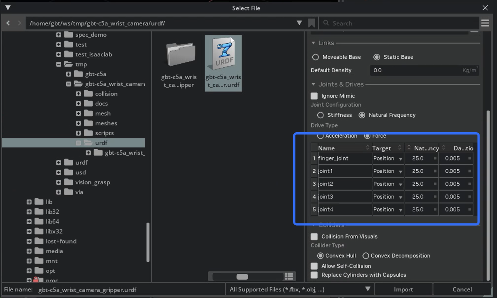
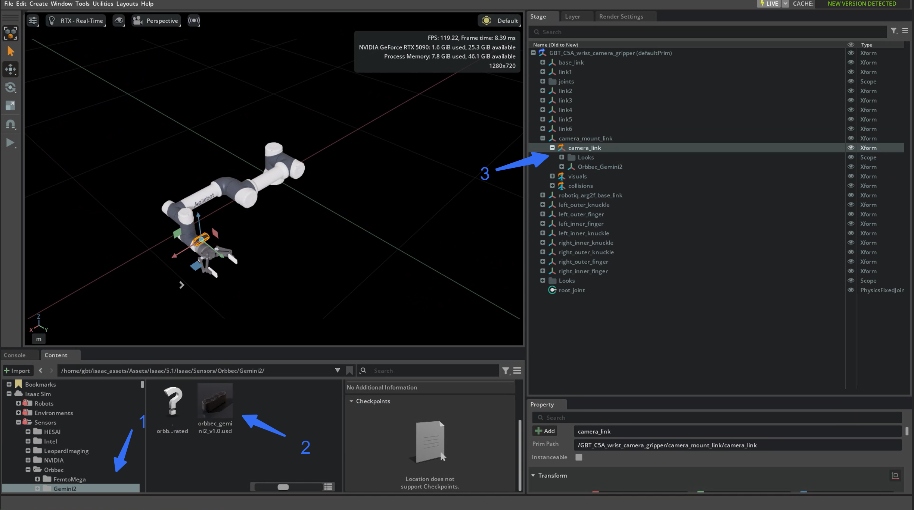
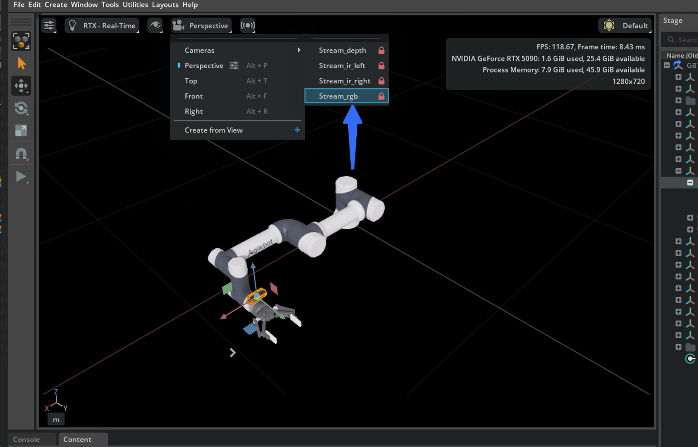

# GBT C5A Wrist Camera Gripper

[English README](README.md)

本目录提供一个组合 URDF，包含 GBT C5A 机械臂、腕部相机安装支架和 Robotiq 2F-140 夹爪，并附带 Isaac Sim 导入和相机挂载辅助脚本。

注意事项：

- 仓库默认提供的是 URDF 工作流，不发布 Robotiq 夹爪转换后的 USD。
- 夹爪部分仅提供 URDF 引用方式，需用户自行准备合法来源的网格并在 Isaac Sim 中转换生成 USD。
- 腕部相机需要用户在转换后的机器人 USD 上自行挂载。
- 相机支架模型由 AI 辅助生成，仅作为演示用途，不代表量产结构或实物设计。

首次使用建议按下面顺序操作：

1. 补齐 URDF 依赖的 Robotiq STL 文件。
2. 在 Isaac Sim 中导入 `urdf/gbt-c5a_wrist_camera_gripper.urdf`。
3. 使用 Isaac Sim 图形界面基于 URDF 生成机器人 USD，并设置关节驱动参数。
4. 手动或通过脚本把在线相机 USD 挂到转换后的 `camera_link`。

## 仓库结构

- `urdf/gbt-c5a_wrist_camera_gripper.urdf`：组合机器人 URDF。
- `urdf/gbt-c5a_wrist_camera_gripper/`：本地导入后生成的 USD 和配置层目录，默认不纳入版本管理。
- `meshes/visual/`：机械臂、相机支架和复制进来的 Robotiq STL 可视化网格。
- `meshes/collision/`：碰撞网格和复制进来的 Robotiq STL。
- `scripts/setup_robotiq_meshes.sh`：把所需 Robotiq STL 复制到本仓库。
- `scripts/convert_urdf_to_usd.py`：实验性的脚本导入路径，可参考，不是推荐流程。
- `scripts/add_online_camera_usd.py`：将在线相机 USD 挂到 `camera_link` 下。

## 1. 安装 URDF 所需的 Robotiq STL

### 版权说明

- 本仓库不分发 Robotiq STL 资源。
- 需要你自行从合法来源下载 Robotiq 2F-140 STL 文件。

参考来源：

- `https://github.com/ros-industrial-attic/robotiq`

### 需要的 STL 文件

准备以下 6 个文件：

- `robotiq_arg2f_base_link.stl`
- `robotiq_arg2f_coupling.stl`
- `robotiq_arg2f_140_outer_knuckle.stl`
- `robotiq_arg2f_140_outer_finger.stl`
- `robotiq_arg2f_140_inner_knuckle.stl`
- `robotiq_arg2f_140_inner_finger.stl`

### 一键安装

将 STL 下载到本地某个目录后，执行：

```bash
bash scripts/setup_robotiq_meshes.sh /path/to/robotiq_stl_dir
```

脚本会复制到：

- `meshes/visual/`
- `meshes/collision/`

完成后，`urdf/gbt-c5a_wrist_camera_gripper.urdf` 就可以进入导入流程。

## 2. URDF 结构概览

该 URDF 已经包含腕部相机安装位和夹爪结构。导入前只需要确认网格依赖完整。

说明：

- 夹爪部分是 URDF 级集成，不表示仓库会发布对应的夹爪 USD 成品。
- 腕部相机支架仅用于演示相机安装位和视角方案。

关键链路和关节：

- 机械臂关节：`joint1` 到 `joint6`
- 相机支架固定关节：`camera_mount_joint`
- 相机挂载点：`camera_link`
- 夹爪固定关节：`gripper_joint`
- 夹爪主动关节：`finger_joint`
- 夹爪 mimic 关节：`left_inner_knuckle_joint`、`left_inner_finger_joint`、`right_outer_knuckle_joint`、`right_inner_knuckle_joint`、`right_inner_finger_joint`

在线相机 USD 最终挂在 `camera_link`。

## 3. 在 Isaac Sim 中导入 URDF

当前推荐流程是使用 Isaac Sim 图形界面导入。`scripts/convert_urdf_to_usd.py` 保留为实验性替代方案，不建议作为默认流程。

### 导入入口

在 Isaac Sim 中打开 URDF Importer，并使用：

- 输入文件：`urdf/gbt-c5a_wrist_camera_gripper.urdf`
- 输出文件：`urdf/gbt-c5a_wrist_camera_gripper/gbt-c5a_wrist_camera_gripper.usd`

### 推荐关节驱动参数

导入时重点关注 `Joints & Drives`。

- 机械臂关节 `joint1` 到 `joint6`：`Target = Position`，`Natural Frequency = 300`
- 夹爪主动关节 `finger_joint`：`Target = Position`，`Natural Frequency = 300`
- 夹爪 mimic 关节：`Natural Frequency = 2500`

同时确认：

- `Joint Configuration = Natural Frequency`
- `Drive Type = Force`

阻尼一般保持 Isaac Sim 默认值即可；如果后续夹爪响应偏软，再结合控制器做调整。

参考图片：

- `docs/images/isaacsim_urdf_import_joint_settings.png`
- `docs/images/isaacsim_manual_drag_camera.png`



### 导入后的结果

导入完成后，通常应在本地看到以下文件：

- `urdf/gbt-c5a_wrist_camera_gripper/gbt-c5a_wrist_camera_gripper.usd`
- `urdf/gbt-c5a_wrist_camera_gripper/configuration/gbt-c5a_wrist_camera_gripper_base.usd`
- `urdf/gbt-c5a_wrist_camera_gripper/configuration/gbt-c5a_wrist_camera_gripper_physics.usd`
- `urdf/gbt-c5a_wrist_camera_gripper/configuration/gbt-c5a_wrist_camera_gripper_robot.usd`
- `urdf/gbt-c5a_wrist_camera_gripper/configuration/gbt-c5a_wrist_camera_gripper_sensor.usd`

## 4. 挂载在线相机 USD

机器人 USD 生成后，再执行相机挂载步骤。

推荐相机资源：

- `Isaac/Sensors/Orbbec/Gemini2/orbbec_gemini2_v1.0.usd`

### 手动方式

在 Isaac Sim 中：

1. 在 `Content` 或 `Asset Browser` 打开 `Isaac/5.1/Isaac/Sensors/Orbbec/Gemini2/`。
2. 找到 `orbbec_gemini2_v1.0.usd`。
3. 在 `Stage` 中找到 `camera_link`。
4. 将相机 USD 拖到 `camera_link` 下。

常见 `camera_link` Prim 路径：

- `/GBT_C5A_wrist_camera_gripper/camera_mount_link/camera_link`
- `/World/GBT_C5A_wrist_camera_gripper/camera_mount_link/camera_link`



### 脚本方式

在 Isaac Sim 或 Isaac Lab 的 Python 环境中运行：

```bash
python scripts/add_online_camera_usd.py
```

如果要显式指定目标 Stage：

```bash
python scripts/add_online_camera_usd.py urdf/gbt-c5a_wrist_camera_gripper/gbt-c5a_wrist_camera_gripper.usd
```

脚本会：

- 找到目标 USD Stage
- 自动定位 `camera_link`
- 将 `orbbec_gemini2_v1.0.usd` 作为引用添加到对应 Prim
- 清理历史遗留的旧相机引用

## 5. 验证相机是否挂载成功

把相机 USD 挂到 `camera_link` 后，建议直接在 Isaac Sim 中做可视化验证。

1. 加载 `gbt-c5a_wrist_camera_gripper.usd`。
2. 打开视口中的相机菜单。
3. 展开 `Cameras` 并切换到 `Stream_rgb`。
4. 确认画面中能看到夹爪。

验证通过的标准：

- 可以正常切换到 `Stream_rgb`
- 画面不是黑屏或空视野
- RGB 视角中能看到夹爪

如果看不到夹爪，优先检查：

- 相机 USD 是否确实挂在 `camera_link` 下
- `camera_link` 的姿态是否被意外修改
- 当前选择的是 RGB 流，而不是深度流或红外流



## 6. 检查表

完整流程结束后，至少应满足：

- 6 个 Robotiq STL 已复制到 `meshes/visual/` 和 `meshes/collision/`
- `urdf/gbt-c5a_wrist_camera_gripper.urdf` 已成功导入 Isaac Sim
- 导入时已按推荐值设置 `Natural Frequency`
- 已生成 `urdf/gbt-c5a_wrist_camera_gripper/gbt-c5a_wrist_camera_gripper.usd`
- 在线相机 USD 已挂到 `camera_link`
- 在 `Stream_rgb` 中能看到夹爪

## 7. 参考资料

- URDF Importer Extension:
  `https://docs.isaacsim.omniverse.nvidia.com/5.1.0/importer_exporter/ext_isaacsim_asset_importer_urdf.html`
- Setup a Manipulator:
  `https://docs.isaacsim.omniverse.nvidia.com/5.1.0/robot_setup_tutorials/tutorial_import_assemble_manipulator.html`
